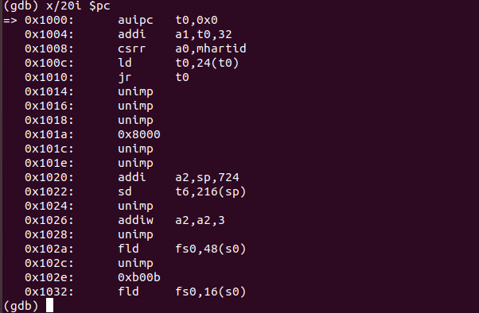
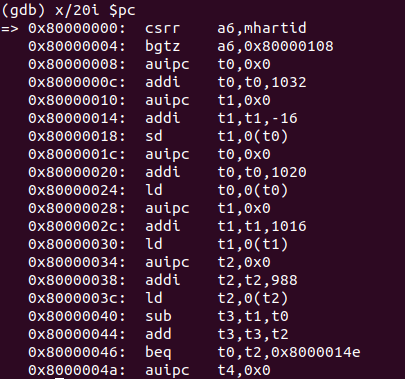
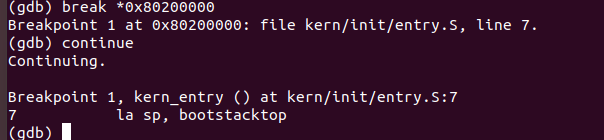

# Lab0.5

### 练习 1: 使用 GDB 验证启动流程

首先观察kernel.ld,其中定义了一系列初始化命令

首先定义ENTRY(kern_entry)

依次从0x80200000进行初始化

.text

.rdate

.data .sdata

.bss

```cpp
/* tools/kernel.ld */

OUTPUT_ARCH(riscv) /* 指定输出文件的指令集架构, 在riscv平台上运行 */
ENTRY(kern_entry)  /* 指定程序的入口点, 是一个叫做kern_entry的符号。我们之后会在汇编代码里定义它*/

BASE_ADDRESS = 0x80200000;/*定义了一个变量BASE_ADDRESS并初始化 */

/*链接脚本剩余的部分是一整条SECTIONS指令，用来指定输出文件的所有SECTION
 "." 是SECTIONS指令内的一个特殊变量/计数器，对应内存里的一个地址。*/
SECTIONS
{
    /* Load the kernel at this address: "." means the current address */
    . = BASE_ADDRESS;/*对 "."进行赋值*/
    /* 下面一句的意思是：从.的当前值（当前地址）开始放置一个叫做text的section. 
     花括号内部的*(.text.kern_entry .text .stub .text.* .gnu.linkonce.t.*)是正则表达式
     如果输入文件中有一个section的名称符合花括号内部的格式
     那么这个section就被加到输出文件的text这个section里
     输入文件中section的名称,有些是编译器自动生成的,有些是我们自己定义的*/
    .text : {
        *(.text.kern_entry) /*把输入中kern_entry这一段放到输出中text的开头*/
        *(.text .stub .text.* .gnu.linkonce.t.*)
    }

    PROVIDE(etext = .); /* Define the 'etext' symbol to this value */
    /*read only data, 只读数据，如程序里的常量*/
    .rodata : {
        *(.rodata .rodata.* .gnu.linkonce.r.*)
    }

    /* 进行地址对齐，将 "."增加到 2的0x1000次方的整数倍，也就是下一个内存页的起始处 */
    . = ALIGN(0x1000);


    .data : {
        *(.data)
        *(.data.*)
    }
    /* small data section, 存储字节数小于某个标准的变量，一般是char, short等类型的 */
    .sdata : {
        *(.sdata)
        *(.sdata.*)
    }

    PROVIDE(edata = .);
    /* 初始化为零的数据 */
    .bss : {
        *(.bss)
        *(.bss.*)
        *(.sbss*)
    }

    PROVIDE(end = .);
    /* /DISCARD/表示忽略，输入文件里 *(.eh_frame .note.GNU-stack)这些section都被忽略，不会加入到输出文件中 */
    /DISCARD/ : {
        *(.eh_frame .note.GNU-stack)
    }
}
```

之后在entry.S中进行汇编补充

```cpp
# kern/init/entry.S
#include <mmu.h>
#include <memlayout.h>

# The ,"ax",@progbits tells the assembler that the section is allocatable ("a"), executable ("x") and contains data ("@progbits").
# 从这里开始.text 这个section, "ax" 和 %progbits描述这个section的特征
# https://www.nongnu.org/avr-libc/user-manual/mem_sections.html
.section .text,"ax",%progbits 
    .globl kern_entry # 使得ld能够看到kern_entry这个符号所在的位置, globl和global同义
    # https://sourceware.org/binutils/docs/as/Global.html#Global
kern_entry: 
    la sp, bootstacktop 
    tail kern_init 
#开始data section
.section .data
    .align PGSHIFT #按照2^PGSHIFT进行地址对齐, 也就是对齐到下一页 PGSHIFT在 mmu.h定义
    .global bootstack #内核栈
bootstack:
    .space KSTACKSIZE #留出KSTACKSIZE这么多个字节的内存
    .global bootstacktop #之后内核栈将要从高地址向低地址增长, 初始时的内核栈为空
bootstacktop:
```

分配好内核栈，然后跳转到 `kern_init`, 进入 `kern_init`才是，真正的入口点

```
// kern/init/init.c
#include <stdio.h>
#include <string.h>
//这里include的头文件， 并不是C语言的标准库，而是我们自己编写的！

//noreturn 告诉编译器这个函数不会返回
int kern_init(void) __attribute__((noreturn));

int kern_init(void) {
    extern char edata[], end[]; 
    //这里声明的两个符号，实际上由链接器ld在链接过程中定义, 所以加了extern关键字
    memset(edata, 0, end - edata); 
    //内核运行的时候并没有c标准库可以使用，memset函数是我们自己在string.h定义的

    const char *message = "(THU.CST) os is loading ...\n";
    cprintf("%s\n\n", message); //cprintf是我们自己定义的格式化输出函数
       while (1)
        ;
}
```

定义了封装的函数。

### 实验流程

Makefile 中建立kernel

```c
# kernel

KINCLUDE	+= kern/debug/ \
			   kern/driver/ \
			   kern/trap/ \
			   kern/libs/\
			   kern/mm/ \
			   kern/arch/

KSRCDIR		+= kern/init \
			   kern/debug \
			   kern/libs \
			   kern/driver \
			   kern/trap \
			   kern/mm

KCFLAGS		+= $(addprefix -I,$(KINCLUDE))

$(call add_files_cc,$(call listf_cc,$(KSRCDIR)),kernel,$(KCFLAGS))

KOBJS	= $(call read_packet,kernel libs)
```

加载kernel后生成img


链接程序完成，实现跳转到0x80200000执行初始化工作



进入gdb，首先是t0存入地址0x80000000



跳转后



输出程序在0x80200000

最后执行

```
    const char *message = "(THU.CST) os is loading ...\n";
    cprintf("%s\n\n", message); //cprintf是我们自己定义的格式化输出函数
       while (1)
```

完成程序
